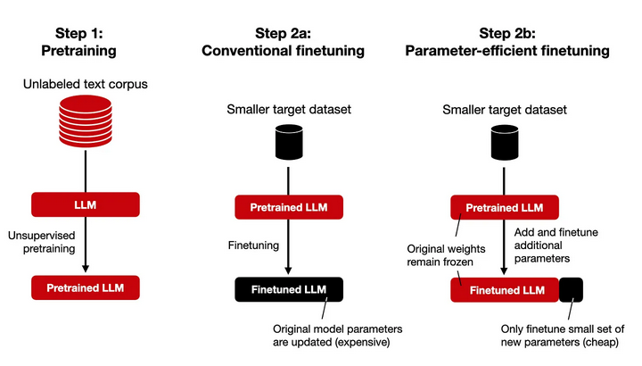
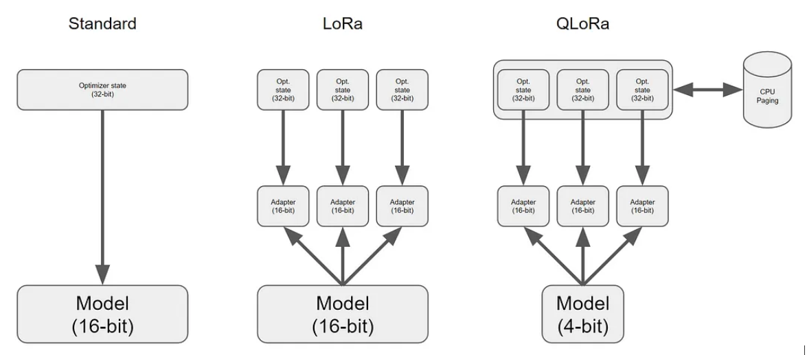

# Tutorial about LLM Finetuning with QLORA on a Single GPU

This tutorial will guide you through the process of fine-tuning a Language Model (LLM) using the [QLORA](https://arxiv.org/pdf/2305.14314.pdf) technique on a single GPU. We will be using the Hugging Face Transformers library, PyTorch, and the peft and datasets packages. The goal is to fine-tune an LLM for a specific task using a provided dataset and then perform inference on the trained model.

## Introduction

While LLMs are known to be large, and running or training them in consumer hardware is a huge challenge for users and accessibility. To finetune a LLM on a specific task can be therefore quite challenging. Another approach is to add a small set of parameters to a pretrained LLM. Only the newly added parameters are finetuned while all the parameters of the pretrained LLM remain frozen.



QLoRA is a new technique for fine-tuning large language models (LLMs) that aims to reduce the memory usage required for fine-tuning models with billions of parameters. It achieves this by retropropagating gradients through a quantized and frozen pre-trained language model using Low Rank Adapters (LoRA). As shown on the picture, this technique adds a relatively small amount of trainable parameters (adapters, for each model layer and freezes all the original ones). QLoRA enables efficient fine-tuning on a single GPU while preserving performance. 



For the sake of experimentation, we will be using a custom dataset containing questions and answers regarding the recently announced [Apple Vision Pro](https://fr.wikipedia.org/wiki/Apple_Vision_Pro) product. Given that LLM models have been trained on general datasets prior to 2021, they are unlikely to perform well in answering questions about the Apple Vision Pro product.

I wrote a minimalist version of the training code to make it easier to understand in `main.py`

Prerequisites

Before proceeding, make sure you have the following:

- A GPU with CUDA support
- Python 3.6 or higher installed
- transformers, torch, peft, and datasets libraries installed

You can install the required libraries using pip:

```
pip install -q -U bitsandbytes
pip install -q -U git+https://github.com/huggingface/transformers@de9255de27abfcae4a1f816b904915f0b1e23cd9
pip install -q -U git+https://github.com/huggingface/peft.git
pip install -q -U git+https://github.com/huggingface/accelerate.git
pip install -q -U einops
pip install -q -U safetensors
pip install -q -U torch
pip install -q -U xformers
pip install -q -U datasets
```

I got some errors during the training when installing the standard libraries, but I should be fixe by now). 
Otherwise, please install the following libraries to fix the errors.


## Step 1: Creating a Custom Dataset

For the needs of this tutorial, I created a custom dataset containing questions and answers regarding the recently
announced [Apple Vision Pro](https://fr.wikipedia.org/wiki/Apple_Vision_Pro) product. I wrote the questions and answers
using the information published on wikipedia. The dataset is in JSON format .


## Step 2: Loading the Pretrained Model

Next, we'll load the pretrained LLM model and tokenizer. We'll also configure the quantization settings using BitsAndBytesConfig.

## Step 3: Preparing the Training Dataset

We'll now prepare the training dataset by loading it from a JSON file using the load_dataset function and applying necessary preprocessing (tokenization, padding, etc.).

## Step 4: Launching the Training

With the model, tokenizer, and training dataset ready, we can now launch the fine-tuning process. We'll define the training configuration using transformers.TrainingArguments and create a Trainer instance to handle the training. Note that for this experiment, I used the falcon-7b model, but you can use any other LLM you want.

## Step 5: Performing Inference

Once the training is complete, we can perform inference on the trained model. We ask the model to described the vision pro of apple in 3 sentences.

The given answer should be this one:

```
The Vision Pro is a high-end VR headset developed by Apple. It offers a 120-degree field of view, 4K resolution, and a 120Hz refresh rate. The device is powered by a custom-built processor, allowing for a smooth and immersive experience.
```

Please note that the final model is not available in this repository, as it is way too large.

# Important remark

If you like you like this project, feel free to leave a star. (it is my only reward ^^)